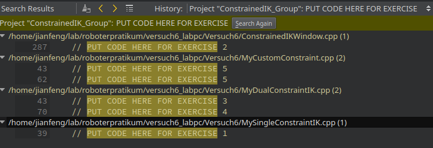
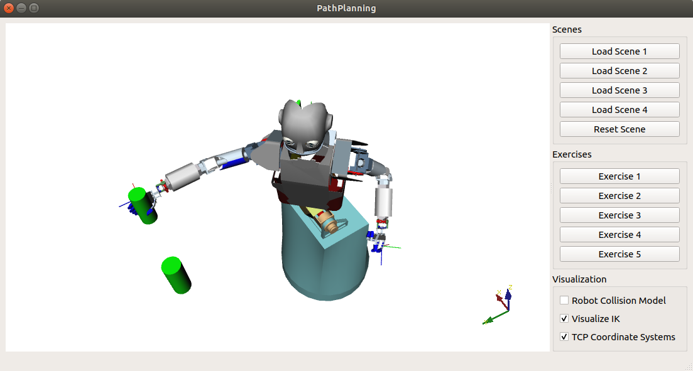

 
# Where is my project?

The `<project_dir>` is `~/workspace/ik/exercise/`

- go to project directory
```shell
cd <project_dir>
```


# How to start my exercise?

- open a terminal and start QtCreator
```shell
qtcreator &
```
- In QtCreator, `Ctrl + O` to open a project. 
- Navigate to your project in `<project_dir>` folder
- Select `CMakeLists.txt` and open
- Open file `MySingleConstraintIK.cpp` and `Ctrl + F`, click `Advanced...`. Select `Project "ConstrainedIK_group#"` in `Scope:` and type `PUT CODE HERE FOR EXERCISE` in `Search for:`. And click `Search` button. This will show you all the exercises you need to finish.




For example, the exercise 1 code block 

```cpp
/*
 * Exercise 1
 */
bool MySingleConstraintIK::solveIkStep()
{
    // The current Jacobian matrix for the chosen constraint
    // Eigen::MatrixXf J = constraint->getJacobianMatrix();

    // The Jacobian's pseudoinverse
    // Eigen::MatrixXf J_inv = VirtualRobot::MathTools::getPseudoInverse(J);

    // The constraint's current error vector
    // Eigen::VectorXf e = constraint->getError();

    // Getting and setting the robot's current configuration
    // Eigen::VectorXf config;
    // nodeSet->getJointValues(config);
    // nodeSet->setJointValues(config + delta);

    float error_delta = 0.1;
    float error_epsilon = 0.1;

    // PUT CODE HERE FOR EXERCISE 1

    return false;
}
```

you can find the sample codes in the commented blocks, which show you basically how to implement such an algorithm with ArmarX.

# How can I build the project and test

you can build your project using QtCreator. Or you can build it using command-line tools. 

```shell
cd <project_dir>/build
cmake ..
make -j30
```

you can run your project in QtCreator or 

```shell
cd <project_dir>/build
./ConstrianedIK
```

You will get this window with Armar3 and 2 objects in the air, which are the grasping targets. The coordinate system of the two objects have the 
same orientation as the global coordinate system on the bottom right of the view. The coordinate system of the left and right hand of the robot
can be visualized by clicking the checkbox "TCP Coordinate Systems".



test your program for each exercise with all 4 different scenes simply by clicking 

1. `Load scene #`, 
2. `Exercise #`
3. `Reset scene`
4. `Load scene #` and so on. Until you test each exercise with all scenes.

Observe the difference of the motion of the robot when the scene changes and also compare different algorithms you implemented for the same scene (especially for exercise 3 and 4.


# Some note

- In the testing window, you can find a check box `TCP Coordinate systems`. The Coordinate system of the two target objects are the same as world frame. This is important for some of the tasks, e.g. exercise 2.

- you can find how the robot nodesets are defined in `ConstrainedIKWindow.cpp`

    ```cpp
    nodeSet = robot->getRobotNodeSet("TorsoBothArms");
    nodeSetFull = robot->getRobotNodeSet("Robot");
    ```

- Before you start coding, read the software structure a little bit to understand how to implement your exercise 2 ~ 5.

    ```cpp
    void ConstrainedIKWindow::exercise2()
    {
        ...
    }
    ```

    make sure you understand the structure of this project.

- Make sure you understand the Jacobian matrices and their dimension correctly.
- Some useful hints for using QtCreator
    - put your cursor within a function name or a variable name and press F2 you can jump to the declaration.
    - Alt + left/right arrow to jump to the previous/next view session
    - other hotkeys can be found in Qtcreator.

# What should my result look like?

I built the project in advance and put the result in `~/.test/ik_results/exercise/` folder. 

```
cd ~/.test/ik_results/exercise/build
./ConstrainedIK
```
and play around with it.


# Handover your codes and homework when you finish

Compress your codes and the homework document and send it to `jianfeng.gao@kit.edu` with subject `IK-Group<Your Group Number>`. e.g. `IK-Group2`.

```
- IK-Group2
    - exercise [folder]
    - homework.odt
```

# How to get help?

- find me in room 333 or 003
- send me an email: jianfeng.gao@kit.edu
