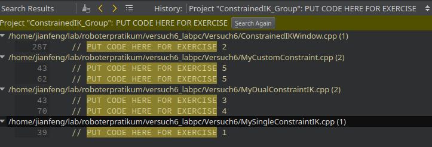
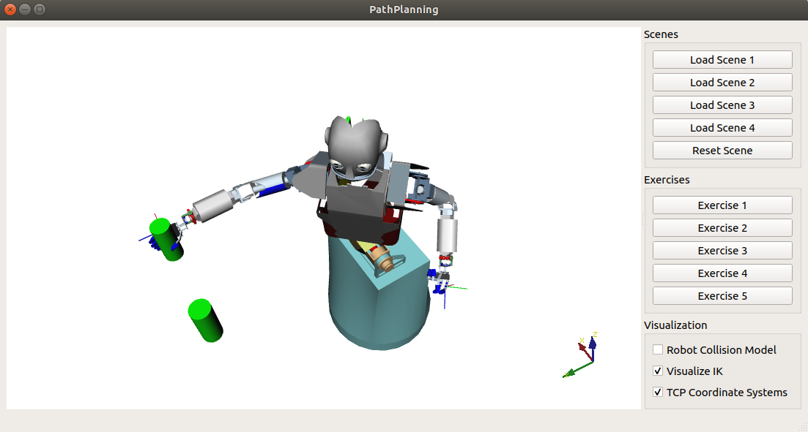

 
# Where is my project?

The `<project_dir>` is `~/workspace/ik/Versuch6/`

- go to project directory
```shell
cd <project_dir>
```


# How to start my exercise?

- open a terminal and start QtCreator
```shell
qtcreator &
```
- In QtCreator, `Ctrl + O` to open a project. 
- Navigate to your project in `<project_dir>` folder
- Select `CMakeLists.txt` and open
- Make sure that the project name is assigned with your group name, 
    
    find the first line in `CMakeLists.txt` and append your group number after 'Group'
    ```shell
    PROJECT(ConstrainedIK_Group)
    ``` 
    to 
    ```shell
    PROJECT(ConstrainedIK_Group<Your Group Number>)
    ``` 
    e.g. ```PROJECT(ConstrainedIK_Group2)```

- Open file `MySingleConstraintIK.cpp` and `Ctrl + F`, click `Advanced...`. Select `Project "ConstrainedIK_group#"` in `Scope:` and type `PUT CODE HERE FOR EXERCISE` in `Search for:`. And click `Search` button. This will show you all the exercises you need to finish.




For example, the exercise 1 code block 
```cpp
/*
 * Exercise 1
 */
bool MySingleConstraintIK::solveIkStep()
{
    // The current Jacobian matrix for the chosen constraint
    // Eigen::MatrixXf J = constraint->getJacobianMatrix();

    // The Jacobian's pseudoinverse
    // Eigen::MatrixXf J_inv = VirtualRobot::MathTools::getPseudoInverse(J);

    // The constraint's current error vector
    // Eigen::VectorXf e = constraint->getError();

    // Getting and setting the robot's current configuration
    // Eigen::VectorXf config;
    // nodeSet->getJointValues(config);
    // nodeSet->setJointValues(config + delta);

    float error_delta = 0.1;
    float error_epsilon = 0.1;

    // PUT CODE HERE FOR EXERCISE 1

    return false;
}
```

you can find the sample codes in the commented blocks, which show you basically how to implement such an algorithm with ArmarX.

# How can I build the project and test

you can build your project using QtCreator. Or you can build it using command-line tools. 
```shell
cd <project_dir>/build
cmake ..
make -j7
```

you can run your project in QtCreator or 

```shell
cd <project_dir>/build
./ConstrianedIK_Group#
```

**Don't forget to replace `<project_dir>` with your project directory and `group#` with your group number**

You will get this window with Armar3 and 2 objects in the air, which are the grasping targets.


test your program for each exercise with all 4 different scenes simply by clicking `Load scene #`, `Reset scene` and `Exercise #`

- Load different scenes to test each of your exercise, to make sure your algorithms are general enough under different situations.
- Observe the difference of the motion of the robot.


# Some note

- In the testing window, you can find a check box `TCP Coordinate systems`. The Coordinate system of the two target objects are the same as world frame. This is important for some of the tasks.

- you can find how the robot nodesets are defined in `ConstrainedIKWindow.cpp`
```cpp
nodeSet = robot->getRobotNodeSet("TorsoBothArms");
nodeSetFull = robot->getRobotNodeSet("Robot");
```
Before you start coding, read the software structure a little bit to understand how to implement your exercise 2 ~ 5.
```cpp
void ConstrainedIKWindow::exercise2()
{
    ...
}
```
make sure you understand the structure of this project.

- Make sure you understand the Jacobian matrices and their dimension correctly.
- QtCreator
    - put your cursor within a function name or a variable name and press F2 you can jump to the declaration.
    - Alt + left/right arrow to jump to the previous/next view session
    - other hotkeys can be found in Qtcreator.

# What should my result look like?

I built the project in advance and put the result in `~/.test_versuch6` folder. 
```
cd ~/.Versuch6/build/
./ConstrainedIK
```
and play with it.


# Handover your codes and homework

compress your codes and the homework document and send it to `jianfeng.gao@kit.edu` with subject `IK-Group<Your Group Number>`. e.g. `IK-Group2`.

```
- IK-Group2
    - Versuch6 [folder]
    - homework.odt
```

# How to get help?

- find me in room 333
- send me an email: jianfeng.gao@kit.edu
